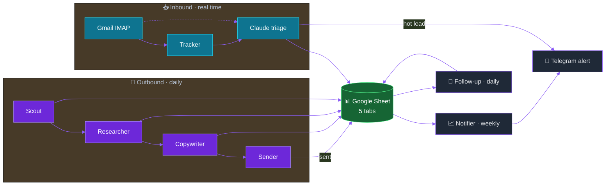

<!-- Banner -->
<p align="center">
  
</p>

<!-- Language switch -->
<p align="center">
  <b>🇬🇧 English</b> &nbsp;·&nbsp; <a href="README.ru.md">🇷🇺 Русский</a>
</p>

<!-- Badges -->
<p align="center">
  
  
  
  
</p>

<br />

## What this is

A cold-email system that handles the boring 80% of B2B outreach on its own. It finds companies that fit, reads their website, writes a short email in their own language, sends it at a human pace, and sorts the replies so I only ever open the ones worth answering.

Under the hood it's seven small [n8n](https://n8n.io/) workflows and a single Google Sheet. No custom backend, no database, no dashboard to babysit.

> [!NOTE]
> **About the status.** This is a working prototype, not a live product. I built it, ran a real 10-day pilot, learned what I needed to, then put it on pause to rethink the approach. Everything in this repo is real and runnable. Just don't read it as "a business that's making money today".

<br />

## The problem it solves

Cold outreach eats time in predictable ways. Someone has to build the list, open each site, find an angle, write the email, send it without getting the domain flagged, then watch the inbox and react to whatever comes back. For one person that's easily 15 to 25 hours a week, and almost none of it is interesting.

I wanted to see how much of that a single operator could hand off without the result turning into obvious spam. Not "blast 10,000 emails". The opposite of that. Low volume, careful targeting, and emails that read like a person actually sat down and wrote them.

<br />

## How it works

Two pipelines and a shared sheet. One pipeline goes out, one comes in, and two small helpers keep things tidy.



Each of the seven workflows does one job and hands off through the sheet:

| # | Workflow | What it does |
|---|----------|--------------|
| 1 | **Scout** | Finds prospects from public directories, dedupes by domain, scores them by simple signals (has a chat widget, has a contact form, page speed). |
| 2 | **Researcher** | Opens each site, has Claude pick out one or two concrete pain points, writes them back to the row. |
| 3 | **Copywriter** | Writes an A/B subject line and a short body in the prospect's language, using the pain point as the angle. |
| 4 | **Sender** | Sends via Gmail SMTP at 3 to 5 emails an hour, picks subject A or B at random, marks the row as sent. |
| 5 | **Tracker** | Reads the inbox over IMAP, matches replies to sent emails, and has Claude sort each one: interested, not interested, out of office, unsubscribe, referral, or neutral. |
| 6 | **Notifier** | Every Monday morning, rolls up the week into one Telegram report and a history row. |
| 7 | **Follow-up** | Five days later, sends one more email to people who never replied, then leaves them alone. |

<br />

## The thinking behind it

The interesting part isn't the automation, it's the choices. A few that matter:

- **Send slowly, on purpose.** Sending 100 emails in an hour gets a Gmail account flagged. Sending the same 100 over a full day doesn't. Volume was never the goal, deliverability was.
- **Make the emails sound human.** The writing prompt is unusually strict: no "leverage", no "unlock", no "circle back", no em-dashes, no "Hi [name]" openers. It's told to write like someone typing on their phone between meetings. The whole point is that a recipient can't tell it was generated.
- **Speak the prospect's language.** Dutch agencies get Dutch, Czech agencies get Czech. A cold email in the wrong language is deleted on sight.
- **Let the AI read, not just write.** The same model that writes the emails also reads the replies and tells me which ones are actually worth my time. I only get pinged for the hot ones.
- **Follow up once, then stop.** One nudge after five days, and that's it. Anything more is annoying, and annoying gets you marked as spam.
- **One sheet as the source of truth.** No database. A client can open the Google Sheet and see exactly what's happening. Version history comes for free.

<br />

## Tech stack

<p align="center">
  
</p>

| Layer | Choice | Why |
|-------|--------|-----|
| Orchestration | n8n (self-hosted, PM2) | Visual, fast to change, easy to hand off |
| Writing + reading | Claude Sonnet via Anthropic API | One model does both jobs, no fine-tuning |
| Data store | Google Sheets (service account) | Client-readable, no UI to build, free history |
| Sending | Gmail SMTP | Simple, and rate-friendly if you're careful |
| Receiving | Gmail IMAP (push) | Reacts to replies in under a minute |
| Alerts | Telegram (3 bots) | Hot leads land on your phone in seconds |
| Host | Ubuntu 24 VPS | Cheap, boring, reliable |

<br />

## What the pilot actually showed

Ten days on Dutch real estate agencies, April 2026. Honest numbers, no spin:

| Metric | Result |
|--------|--------|
| Leads discovered | 1,156 |
| Emails sent | 469 |
| Replies | 9 |
| Positive (hot) | 1 |
| Reply rate | 1.9% |
| Operator hours | 0 |

One positive reply out of 469 is not a headline, and I'm not going to pretend otherwise. Two things worth knowing: the pilot ran straight through King's Day, a national holiday week in the Netherlands, which is close to a worst case for B2B email. And a sample this small tells you the machine works end to end, not whether the pitch converts. That second question is exactly what the pause is for.

<br />

## Inside the repo

```
.
├── README.md            ← you are here
├── README.ru.md         ← русская версия
├── SETUP.md             ← full step-by-step deploy guide
├── LICENSE              ← MIT
├── .gitignore
└── workflows/
    ├── worker-1-scout.json
    ├── worker-2-researcher.json
    ├── worker-3-copywriter.json
    ├── worker-4-sender.json
    ├── worker-5-tracker.json      ← the complex one, start here to learn
    ├── worker-6-notifier.json
    └── worker-7-followup.json
```

Every workflow JSON is heavily commented through its node names. If you want to understand the system by reading, go in this order: Scout (simplest), Copywriter (how the Claude calls are built), Sender (the rate-limit loop), then Tracker (real production logic: loop closure, dedup, multi-branch routing).

<br />

## Running it yourself

Everything you need is in **[SETUP.md](SETUP.md)**: the sheet schema, credentials, importing the workflows, and a safe test order before you point it at real people. Rough cost to run is $10 to $30 a month for one niche.

The workflows ship with placeholders instead of secrets, so a fresh import will show broken credential links until you wire in your own. That's expected, SETUP.md walks through it.

<br />

## A few things that took several tries

- **n8n IF nodes break on `undefined` under strict type checking.** Use loose validation for any field that might be missing, or everything silently routes to the false branch.
- **SplitInBatches loops need explicit closure.** Every downstream branch has to connect back to the loop output, or items dangle and the run stalls.
- **Google Sheets "update" only returns the columns you touched.** Read the rest with `$('Node Name').item.json.field`, not `$json`.
- **Send rate matters more than total volume.** 100 emails in an hour is a red flag; the same 100 across a day is fine.

<br />

## License

MIT. Fork it, change it, ship it commercially. Attribution is appreciated but not required.

<br />

<p align="center">
  
</p>
