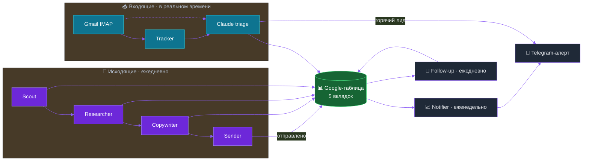

<!-- Banner -->
<p align="center">
  
</p>

<!-- Language switch -->
<p align="center">
  <a href="README.md">🇬🇧 English</a> &nbsp;·&nbsp; <b>🇷🇺 Русский</b>
</p>

<!-- Badges -->
<p align="center">
  
  
  
  
</p>

<br />

## Что это такое

Система холодных писем, которая берет на себя скучные 80% работы B2B аутрича. Она сама находит подходящие компании, читает их сайт, пишет короткое письмо на языке получателя, отправляет его в человеческом темпе и разбирает ответы, чтобы я открывал только те, на которые стоит отвечать.

Внутри это семь небольших воркфлоу [n8n](https://n8n.io/) и одна Google-таблица. Никакого своего бэкенда, никакой базы данных, никакой панели, за которой надо следить.

> [!NOTE]
> **О статусе.** Это рабочий прототип, а не готовый продукт. Я собрал его, провел настоящий 10-дневный пилот, вынес нужные выводы и поставил на паузу, чтобы переосмыслить подход. Все в этом репозитории реальное и запускаемое. Просто не стоит читать это как "бизнес, который сегодня приносит деньги".

<br />

## Какую задачу это решает

Холодный аутрич съедает время предсказуемым образом. Кто-то должен собрать список, открыть каждый сайт, найти зацепку, написать письмо, отправить его так, чтобы домен не улетел в спам, а потом следить за входящими и реагировать на то, что пришло. Для одного человека это легко 15-25 часов в неделю, и почти ничего из этого не интересно.

Мне было любопытно, сколько из этого один оператор может отдать автоматизации так, чтобы результат не превратился в очевидный спам. Не "разослать 10 000 писем". Наоборот. Малый объем, аккуратный таргетинг и письма, которые читаются так, будто их правда писал человек.

<br />

## Как это работает

Два конвейера и общая таблица. Один конвейер идет наружу, другой принимает входящие, а два маленьких помощника наводят порядок.



Каждый из семи воркфлоу делает одну работу и передает результат через таблицу:

| № | Воркфлоу | Что делает |
|---|----------|-----------|
| 1 | **Scout** | Находит компании из публичных каталогов, убирает дубли по домену, оценивает их по простым сигналам (есть чат-виджет, есть форма, скорость сайта). |
| 2 | **Researcher** | Открывает сайт, Claude вытаскивает одну-две конкретные боли и пишет их обратно в строку. |
| 3 | **Copywriter** | Пишет A/B-тему и короткое тело письма на языке получателя, отталкиваясь от найденной боли. |
| 4 | **Sender** | Отправляет через Gmail SMTP по 3-5 писем в час, случайно выбирает тему A или B, помечает строку как отправленную. |
| 5 | **Tracker** | Читает входящие по IMAP, сопоставляет ответы с отправленными письмами, и Claude сортирует каждый: интересно, не интересно, автоответ, отписка, переадресация или нейтрально. |
| 6 | **Notifier** | Каждый понедельник утром сводит неделю в один Telegram-отчет и строку истории. |
| 7 | **Follow-up** | Через пять дней шлет еще одно письмо тем, кто не ответил, и на этом останавливается. |

<br />

## Логика, которая за этим стоит

Интересна не сама автоматизация, а решения. Несколько важных:

- **Отправлять медленно, специально.** 100 писем за час помечают Gmail-аккаунт как подозрительный. Те же 100 за сутки не помечают. Целью был не объем, а доставляемость.
- **Делать письма человеческими.** Промпт для копирайтинга необычно строгий: без "leverage", без "unlock", без "circle back", без длинных тире, без открывашек "Привет, [имя]". Ему велено писать так, будто человек печатает с телефона между встречами. Весь смысл в том, чтобы получатель не понял, что письмо сгенерировано.
- **Говорить на языке получателя.** Голландские агентства получают голландский, чешские чешский. Холодное письмо на чужом языке удаляют сразу.
- **Дать ИИ читать, а не только писать.** Та же модель, что пишет письма, читает и ответы, и говорит мне, какие из них правда стоят времени. Пинг приходит только на горячие.
- **Один follow-up, потом стоп.** Одно напоминание через пять дней, и все. Больше это уже назойливо, а назойливость ведет в спам.
- **Одна таблица как единый источник правды.** Никакой базы. Клиент открывает Google-таблицу и видит ровно то, что происходит. История версий бесплатно.

<br />

## Технологии

<p align="center">
  
</p>

| Слой | Выбор | Почему |
|------|-------|--------|
| Оркестрация | n8n (self-hosted, PM2) | Визуально, быстро менять, легко передать |
| Пишет и читает | Claude Sonnet через Anthropic API | Одна модель на обе задачи, без дообучения |
| Хранилище | Google Sheets (service account) | Читаемо клиентом, не надо строить UI, история бесплатно |
| Отправка | Gmail SMTP | Просто и дружелюбно к rate-лимитам, если аккуратно |
| Прием | Gmail IMAP (push) | Реагирует на ответы меньше чем за минуту |
| Уведомления | Telegram (3 бота) | Горячие лиды на телефоне за секунды |
| Хост | Ubuntu 24 VPS | Дешево, скучно, надежно |

<br />

## Что реально показал пилот

Десять дней по голландским агентствам недвижимости, апрель 2026. Честные цифры, без прикрас:

| Метрика | Результат |
|---------|-----------|
| Найдено лидов | 1156 |
| Отправлено писем | 469 |
| Ответов | 9 |
| Положительных (горячих) | 1 |
| Reply rate | 1.9% |
| Часов оператора | 0 |

Один положительный ответ из 469 это не заголовок, и я не буду делать вид, что это иначе. Два важных момента: пилот шел прямо через День короля, национальную праздничную неделю в Нидерландах, а это почти худший случай для B2B-почты. И выборка такого размера говорит, что машина работает от начала до конца, а не что сам питч конвертит. Как раз ради второго вопроса и сделана пауза.

<br />

## Что внутри репозитория

```
.
├── README.md            ← английская версия
├── README.ru.md         ← вы здесь
├── SETUP.md             ← полная пошаговая инструкция по деплою
├── LICENSE              ← MIT
├── .gitignore
└── workflows/
    ├── worker-1-scout.json
    ├── worker-2-researcher.json
    ├── worker-3-copywriter.json
    ├── worker-4-sender.json
    ├── worker-5-tracker.json      ← самый сложный, начните с него
    ├── worker-6-notifier.json
    └── worker-7-followup.json
```

Каждый JSON воркфлоу подробно закомментирован через имена нод. Если хотите разобраться чтением, идите в таком порядке: Scout (самый простой), Copywriter (как собираются вызовы Claude), Sender (цикл с rate-лимитом), затем Tracker (реальная продовая логика: закрытие цикла, дедуп, ветвление).

<br />

## Как запустить у себя

Все что нужно, лежит в **[SETUP.md](SETUP.md)**: схема таблицы, креды, импорт воркфлоу и безопасный порядок тестов до того, как направить систему на живых людей. Ориентировочная стоимость работы 10-30 долларов в месяц на одну нишу.

Воркфлоу поставляются с плейсхолдерами вместо секретов, так что свежий импорт покажет битые ссылки на креды, пока вы не подставите свои. Это нормально, SETUP.md проведет по шагам.

<br />

## Пара вещей, которые дались не с первого раза

- **IF-ноды n8n ломаются на `undefined` при строгой проверке типов.** Для любого поля, которого может не быть, ставьте loose-валидацию, иначе все молча уходит в ветку false.
- **Циклы SplitInBatches требуют явного замыкания.** Каждая ветка ниже по потоку должна вернуться на выход цикла, иначе элементы повисают и запуск застревает.
- **Google Sheets "update" возвращает только те колонки, что вы тронули.** Остальное читайте через `$('Node Name').item.json.field`, а не `$json`.
- **Темп отправки важнее общего объема.** 100 писем за час это красный флаг, те же 100 за сутки нормально.

<br />

## Лицензия

MIT. Форкайте, меняйте, используйте коммерчески. Атрибуция приветствуется, но не обязательна.

<br />

<p align="center">
  
</p>
